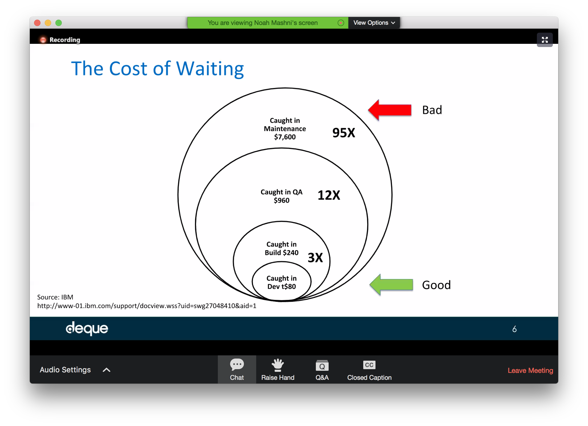
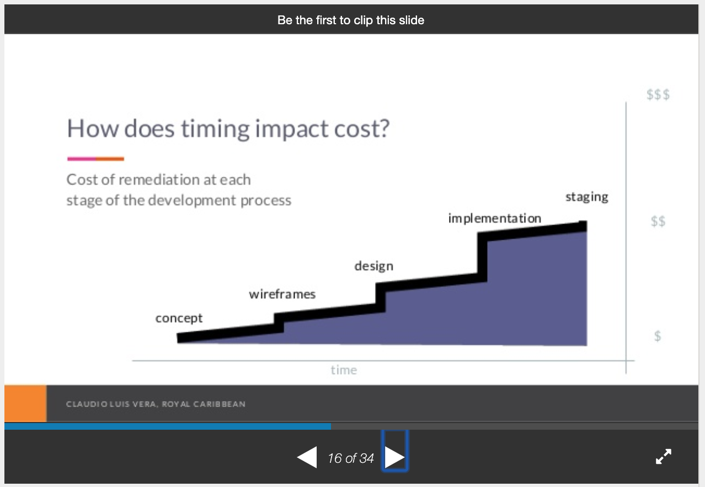
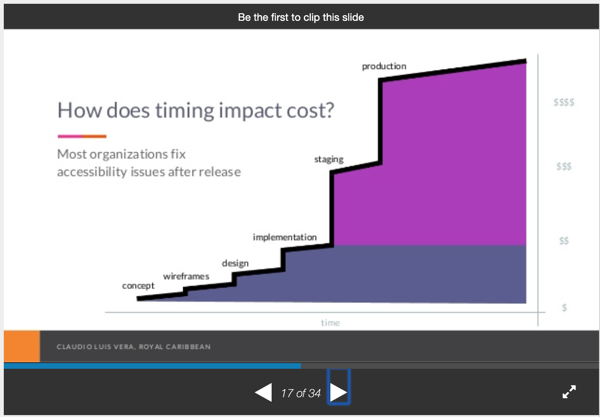

# Ingredients for case

1. About the need for accessibility
2. About the cost of accessibility

---

## 1. About the need for accessibility

### Math is hard. People with disabilities matter – by Sarah Horton

[Source](https://sarahhortondesign.com/2020/12/23/math-is-hard-people-with-disabilities-matter/)

### Reframing Accessibility for the Web - by Anne Gibson

[Source](https://alistapart.com/article/reframing-accessibility-for-the-web/)

### From AbilityNet

- It’s the law – enshrined in the Disability Equality Act (2010).  If your website does not meet certain design standards, then you could be sued for discrimination.
- There’s a compelling business case – the UK’s 12 million disabled people have a spending power of £120 billion. Are you losing out on this potentially lucrative market?
- Accessible websites are 35% more usable by all users - whether they have special access needs or not. 
- Accessible websites are cheaper to run and maintain – they simply make good business sense.

[Source](https://abilitynet.org.uk/accessibility-services/digital-accessibility-resources)

### More than 1 billion people (15%) in the world have a disability. (WHO, 2011)

Source: Global Disability statistics (WHO, World Report on Disability 2011)

[Source](https://businessdisabilityforum.org.uk/knowledge-hub/resources/getting-started-infographics/)

### The Click-Away Pound Survey Report 2016

[Source](http://www.clickawaypound.com/rwbusinesscase.html)

### Stats on UK population not being able to access government digital services

> Borner’s struggle is far from unusual. The Department of Work and Pension’s (DWP) own survey data suggests 46% of people claiming universal credit need help applying online. The same data shows that a quarter of applicants who fail to submit their claims online put it down to difficulties accessing computers or the internet.
> 
> The government expects people to make and manage their claims online, but last year the UN’s rapporteur on extreme poverty, Philip Alston, noted that just over half of people on low incomes in the UK do not have home broadband and 21% of the entire population do not have basic digital skills. Alston said the digital-by-default design of the universal credit system may be contributing to the third of claims never reaching payment, and accused ministers of putting up digital barriers “that effectively obstruct many individuals’ access to their entitlements”.

### Website Accessibility and Buying Power of Persons with Disabilities – Karl Groves (2011)

[According to the Census Bureau (PDF)](https://www.census.gov/prod/2003pubs/c2kbr-17.pdf) 3.6% of the US Population have a sensory disability (hearing or visual), 8.2% have a mobility impairment, 4.8% have a cognitive disorder.  You can say that those with a sensory disability will definitely require an accessible website.  You can also say that a substantial portion of those with mobility and cognitive disabilities will require an accessible website.  I therefore give an estimate of 7-10% of potential customers have a direct need for an accessible website.

[Source](http://www.karlgroves.com/2011/10/21/buying-power-of-persons-with-disabilities/)

### 10 web accessibility myths debunked – User Zoom

The [Global Economics of Disability Annual Report 2016](http://www.rod-group.com/sites/default/files/2016%20Annual%20Report%20-%20The%20Global%20Economics%20of%20Disability.pdf) estimated the global population of people with disabilities (PWD)) as 1.3 billion: a market equivalent in size to the population of China.

 ... | Global | USA | Canada | EU | Asia 
 --- | --- | --- | --- | --- | --- 
 PWD Population | 1.31B | 57mm | 6.2mm | 91.0mm | 748mm 
 PWD Income | >$1.97T | $873B | $113B | $984B | NA 
 PWD Disposable income | >$1.2T | $645B | $55B | $482B | NA 
 Friends & Family Population | 2.4B | 105mm | 12mm | 168mm | 1.38B 
 Friends & Family Disposable income | >7T | $4T | $311B | $2.7T | NA 

Source: US Census, US Bureau of Labor Statistics, StatsCan, EuroStat, Return on Disability Group

Population and income data for people with disabilities and their friends and family, courtesy of Return on Disability.

This works out to more than 17% of the world’s population – with a combined annual disposable income, according to the report, of more than $8 trillion. I think you’ll agree that these aren’t small amounts.

On top of this, one of the largest demographics – the so-called ‘Baby Boomer’ generation – is rapidly adding to this number. If you have a business that caters to older users in any way, you need to bear accessibility considerations in mind. And even if you don’t, a larger percentage of your potential customer base than you might realise will benefit from you making your website accessible.

[Source](https://www.userzoom.com/ux-library/10-website-accessibility-myths-debunked/)

### A four-part accessible design strategy - Alistair Duggin - Meetup #20 - November 2018 - YouTube

Lots of great stats in this presentation.

[Source](https://www.youtube.com/watch?v=4QsYk8XOUlw)

### How many people have a disability? – Full fact

An estimated 19% of working-age adults, and 22% of all people in the UK have a disability, as defined by the Equality Act.

[Source](https://fullfact.org/health/how-many-people-have-disability/?gclid=CjwKCAjw583nBRBwEiwA7MKvoAeNTdnHyZl6vsTlP79NQzRAQ1X1QlOClStFSIZUUOqL96Z3qgNSxhoC_H8QAvD_BwE)

### Family Resources Survey 2018/9 – UK DwP

[Source](https://assets.publishing.service.gov.uk/government/uploads/system/uploads/attachment_data/file/874507/family-resources-survey-2018-19.pdf)

### Family Resources Survey 2019/20 – UK DwP

[Source](https://www.gov.uk/government/statistics/family-resources-survey-financial-year-2019-to-2020/family-resources-survey-financial-year-2019-to-2020#disability-1)

### Disability facts and figures – gov.uk

[Source](https://www.gov.uk/government/statistics/disability-facts-and-figures)

It's also worth bearing in mind that these figures likely won't include many conditions like dyslexia and dyspraxia.

### Disability facts and figures – Scope

[Source](https://www.scope.org.uk/media/disability-facts-figures/)

### How Privilege Defines Performance – Tatiana Mac @ #PerfMatters Conference 2019

[Source](https://youtu.be/nQq_gZiZ-jg)

### Investigating MobileAccessibility Guidance for People with Aphasia – City University 2018

The World Wide Web Consortium’s (W3C) Web Content Accessibility Guidelines (WCAG 2.0) have become  widely accepted  as  the  standard  for  web  accessibility  evaluation. This  poster  investigates  how  the  mobile  version  of  these guidelines   caters   for   people   with   aphasia   (PWA)   by comparing  the  results  from  user  testing  against  that  of  an audit  using  the  guidelines.

Only  13.7%  of  the  total  usability  issues  encountered  by participants could be mapped to the accessibility guidelines.  They   were  mapped   to  5   different   guidelines   from   the accessibility  audit.  The  remaining  63  (86.3%)  usability issues  could  not  be  mapped  to  any  guideline  from  the accessibility audit. 

[Source](https://openaccess.city.ac.uk/id/eprint/20620/1/pd039-grellmann.pdf)

### How to identify a Toxic Accessibility Culture, and what you can do about it – Sheri Byrne-Haber 2019

Seventy percent of disabilities are hidden. Statistically, 9.5 % of people in the work force age range (18 to 65) should have one or more disabilities.

[Source](https://medium.com/@sheribyrnehaber/how-to-identify-a-toxic-accessibility-culture-and-what-you-can-do-about-it-29c8ec9dc500)

### 73% of people that involuntarily leave employment do so because of acquiring a disability or long-term health condition

> 73% of people that involuntarily leave employment do so because of acquiring a disability or long-term health condition
> 
> Diversity is business critical, not just something you prefer not to do
If you employ people with diversity and reflect the society we live in, we have more of a chance to being successful in the market

From a talk by Steve Tyler (Leonard Cheshire).
Available on the London Accessibility Meetup Youtube Channel.

### Facts and figures – Leonard Cheshire

We've pulled together the latest disability facts and figures in one place.

[Source](https://www.leonardcheshire.org/about-us/facts-and-figures)

### The Business Case for Digital Accessibility – W3C

[Source](https://www.w3.org/WAI/business-case/)

### Disability web access: 'I've already clicked away' - BBC News

[Source](https://www.bbc.co.uk/news/business-50391487)

### The business case for accessibility – Deque

[Source](https://www.deque.com/blog/the-business-case-for-accessibility/)

### The business case for inclusive design: The Big Hack study findings – Scope

> 50% of respondents said that they had given up on buying a product because the website, app or in-store machine had accessibility issues

[Source](https://bighack.org/the-business-case-for-inclusive-design-big-hack-study-research-digital-accessibility/)

### Disability Statistics: Information, Charts, Graphs and Tables – Disabled World

In countries with life expectancies over 70 years of age, people spend on average about 8 years, or 11.5 per cent of their life span, living with disabilities.

[Source](https://www.disabled-world.com/disability/statistics/)

### Equivalent Experiences: What Are They? – Eric Bailey, Smashing Magazine

We’ve covered actual people’s everyday frustrations, as well as civil rights and the current legal landscape. If these don’t motivate you, allow me to present another factor to consider: profit.

There are two provoking studies I’d like to call attention to, but they are by no means the only studies performed in this space.

First is the [Click Away Pound Survey](http://clickawaypound.com/), a survey conducted in both 2016 and 2019 to “explore the online shopping experience of people with disabilities and examine the cost to business of ignoring disabled shoppers.”

The survey discovered that more than 4 million people abandoned a retail website because of the access barriers they found. These people represent 17.1 billion pounds (~$21.1 billion USD) in lost potential revenue.

Second is the [The Purchasing Power of Working-Age Adults With Disabilities (PDF)](https://www.air.org/system/files/downloads/report/Hidden-Market-Spending-Power-of-People-with-Disabilities-April-2018.pdf), conducted in 2018 by the American Institutes for Research. This study discovered that there is an estimated $490 billion in disposable income amongst disabled working-age adults. That’s billion with a capital B.

### Tweet from Alastair Somerville

> Reading Rekindling Democracy book now & this comes up.  Well intentioned as a professional ideal but it’s when person is not part of/has no lived experience of the community affected and will be unaffected by any consequences of their intention. It’s a preloaded excuse for damage.

[Source](https://twitter.com/Acuity_Design/status/1286296999424401408)

### Minimizing code defects to improve software quality and lower development costs – IBM 2008, and The Exponential Cost of Fixing Bugs, NIST

There are many studies that show the changes in the cost of fixing defects at different stages of the development process. Based on the cost of fixing a defect at the design stage as having a factor of 1x, these [studies show cost differences](ftp://ftp.software.ibm.com/software/rational/info/do-more/RAW14109USEN.pdf) that increase to 6x during implementation, 15x during testing after code commit, and as high as 100x if caught after the defect makes it into production. [Research by the NIST](https://deepsource.io/blog/exponential-cost-of-fixing-bugs/) estimates the defects fixing costs being as 10x during integration testing and 15x during system testing but only 30x in production.[^2] Regardless of what your organization’s actual costs are, one thing is certain: catching defects in the design and development phase is orders-of-magnitude less expensive than later in the process.

[Source](ftp://ftp.software.ibm.com/software/rational/info/do-more/RAW14109USEN.pdf)

### iPlayer subtitles on stats – Gareth Ford-Williams

Gareth Ford Williams (@GarethFW) Tweeted:
@jfhector @NickColley @katholmes The stats support this. BBC iPlayer 25% of content has subs switched on, 40% of kids content too and social media platforms report 80%+ of all content viewed with the sound switched off.

[Source](https://twitter.com/GarethFW/status/1294525031934984192?s=20)

### Wider benefits – Gareth Ford-Williams

Gareth Ford Williams (@GarethFW) Tweeted:
@NickColley There are lots of examples. Colour contrast is actually about battery life. Most people preserve their battery by turning screen brightness down, high contrast supports this. Taught this by @MollyMayFW...

[Source](https://twitter.com/GarethFW/status/1294523676650504193?s=20)

### As many as people with blue eyes – Molly Watt and Craig Abbott

Craig Abbott (@abbott567) Tweeted:
@NickColley I always use a powerful quote by @MollyWattTalks

1 in 5 people have a disability. It’s the same statistic as people with blue eyes. Imagine saying you can’t use our product because you’ve got blue eyes!

[Source](https://twitter.com/abbott567/status/1294355118687748096?s=20)

### Accessibility is not something extra – Gareth Ford-Williams

Gareth Ford Williams (@GarethFW) Tweeted:
@NickColley BTW accessibility is not something extra. Inaccessibility is caused by design and technical descisions. Cost comes when bad decisions have to be reversed.

[Source](https://twitter.com/GarethFW/status/1294525525822779392?s=20)

### Most people underestimate how many people are disabled – Nick Colley

Nick (@NickColley) Tweeted:
When asked what percentage of the population are disabled:
"Four in ten (41%) thought the level at 10 percent or less.
The actual level is 22 percent."

[Source](https://twitter.com/NickColley/status/1309432031055577093?s=20)

### Proportion of Sainsbury's users who use enlarged font size – Bryn Anderson

30% of sessions on the Sainsburys app use the highest (or a higher?) font size.

I'm listening to The TechShare Procast on Podbean, check it out! https://www.podbean.com/pa/pbblog-iri2c-6356c7

### Being inaccessible is a choice – Gareth Ford-Williams

For starters, being “inaccessible” is a choice. Nothing starts out as inaccessible until people make design and technical decisions. Every poor decisions filters more and more people out…

[Source](https://twitter.com/GarethFW/status/1368849933219094531)

### 40% of UK households have at least one disabled person – via Snook

40% of UK households have at least one disabled person, which is a staggering 11 million households in the UK

[Source](https://medium.com/wearesnook/what-you-can-do-about-accessibility-1040c26beed0)

### The Little Book of Accessibility – Gareth Ford-Williams

Here’s a good, fun [article by Gareth Ford-Williams](https://uxdesign.cc/the-little-book-of-accessibility-a9b59d82b412), who founded the accessibility team at the BBC.

There’s a [video version](https://www.youtube.com/watch?v=p0x5p08eJmA) too. And a [talk version](https://www.youtube.com/watch?v=ikk-v81dxEU&list=PLuo3RMjuSfpLEP_44okejcj8MBRIwHAAK&index=7).

### The business case for inclusive design – Charley Pothecary

[Source](https://www.youtube.com/watch?v=LVXK2EAVkb4)

### Which accessibility settings do the Dutch really use on their phone? – Q42

[Source](https://accessibility.q42.nl/)

### What you need to understand about accessibility – by JF Hector-Labram

[Source](https://youtu.be/fmdIdmicSB4)

---

## 2. About the cost of accessibility

### Cost of making things accessible late

<figure>
  
  <figcaption>
    Compared to catching a defect in development, catching it in Build is 3x higher, catching it in QA is 12 higher, catching it in maintenance is 95x higher.
  </figcaption>
</figure>

### Website Accessibility and Reduced Design, Development, Production, Maintenance Costs – Karl Groves (2011)

> In terms of _new_ development, I don’t see any difference in terms of development time for something inaccessible vs. something accessible (provided the developer understands accessibility).  I generally consider the level of effort to be identical for new development. Additionally, although it could be argued that some reduced maintenance time could be realized, the business always has option to not fix issues that are not related to display and operability, leaving other issues alone.

[Source](https://karlgroves.com/2011/10/07/accessibility-and-reduced-design-development-production-maintenance-costs)

### How Expensive is Web Accessibility? – Karl Groves (2011)

[Source](http://www.karlgroves.com/2011/11/30/how-expensive-is-accessibility/)

### Question to Glenda Sims

#### My question

Hello Glenda, I’m an UX designer/developer learning as much as I can about accessibility – and how to encourage my company to invest in it.

I was just reading your great blog post from 2011 “Design with Accessibility in Mind”.

In it, one of the things you say is that:

``` 
Accessibility experts estimate that the cost of developing sites that meet WCAG 2.0 AA increases development costs by the following:
1% to 3% on simple sites built with html and css (and little to no javascript)
3% to 6% on intermediate sites built with html, css and an intermediate level of javascript
6% to 10% on heavy javascript sites or flash sites
```

I’ve been looking for some stats like this, about the incremental cost of accessibility if it’s bake it throughout the process (rather than done at the end). So I’m very interested in this stat.

I wondered whether you could remember the source for this stat? Or you could think of any other source/stats about this?

Thanks a lot,
Jean-Francois

#### Glenda's answer

HI Jean-Francois, those stats were from my experience as a lead developer at UT Austin.

Also use data for cost of fixing bugs later in the SDLC data…like you find in this article https://crossbrowsertesting.com/blog/development/software-bug-cost/

### Business case for accessibility – Claudio Luis Vera

<figure>
  
  <figcaption>
    Cost of remediation at each stage of the development process. It increases exponentionally as we go from concept to wireframes to design, to implementation.
  </figcaption>
</figure>

<figure>
  
  <figcaption>
    Cost of remediation at each stage of the development process. It increases exponentionally as we go from concept to wireframes to design, to implementation, and then even more quickly when reaching staging and then production. But most organisations fix accessibility issues after release.
  </figcaption>
</figure>

[Source](https://www.slideshare.net/ClaudioLusVera/business-case-for-accessibility)

